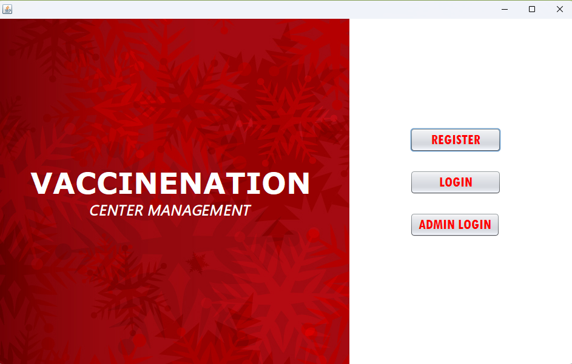
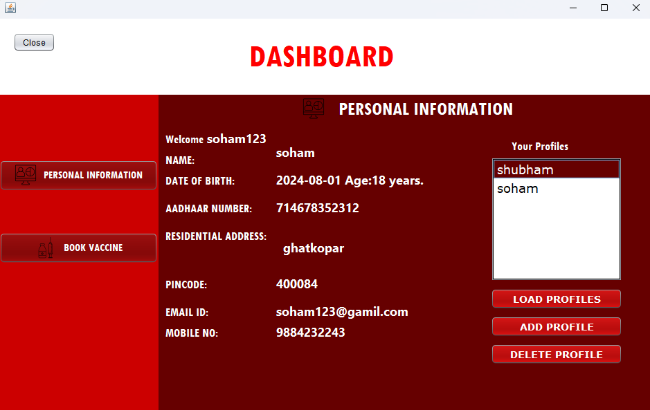
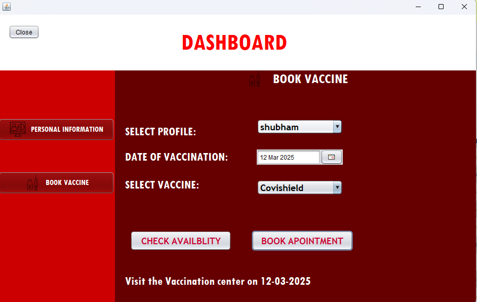
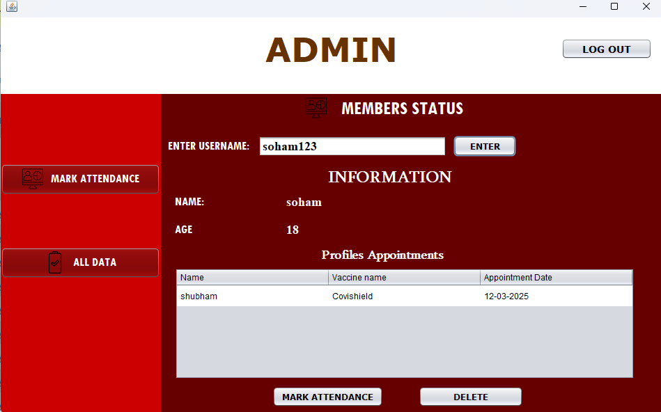
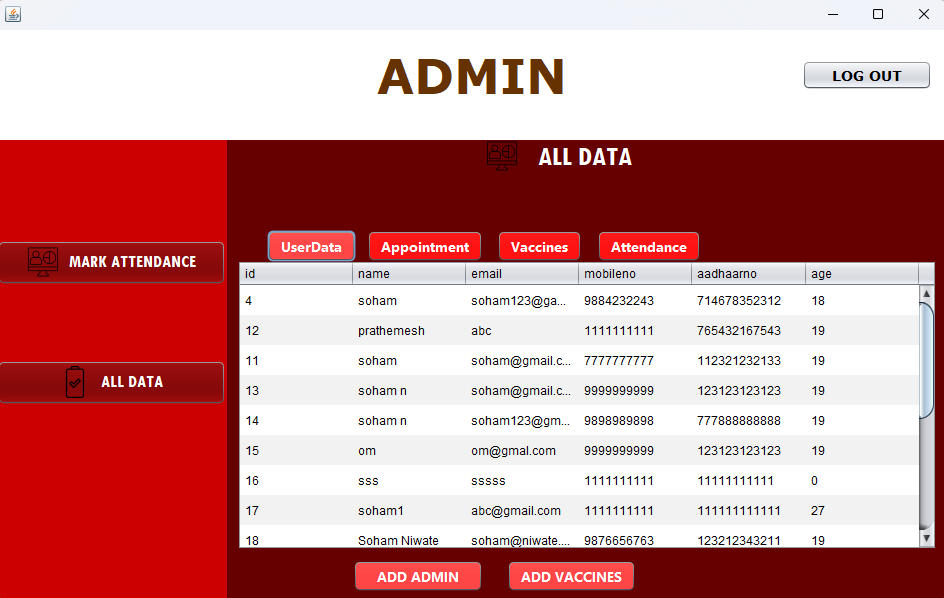
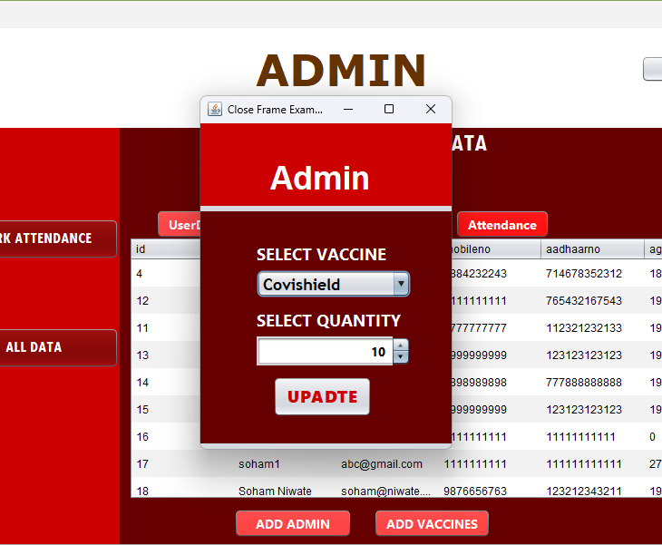

# Vaccine Management System

## 📌 Project Overview
The **Vaccine Management System** is a Java-based application that helps users book vaccine appointments, manage family member profiles, track attendance, and monitor vaccine stock. It provides an easy-to-use interface built with **Java Swing (NetBeans)** and utilizes **MySQL** for database management.

> **This is my 3rd-semester Mini Project, fully functional and developed entirely in Java.**

## ⚙️ Features
### 🏥 User & Member Management
- Users can **register/login** and manage their profiles.
- Users can **add family members** and book vaccine appointments for them.

### 💉 Vaccine Booking System
- Users select a **vaccine** and choose an **appointment date**.
- Vaccination records are stored in the **vaccine_records** table.
- **Appointment validation** ensures the date is within an allowed range.

### 📊 Attendance Tracking
- Tracks vaccinated individuals in an **attendance table**.
- Attendance links **username** and **member_name** from `profiles`.

### 📦 Vaccine Stock Management
- When a user books a vaccine, the **stock quantity is updated**.
- Admins can monitor available vaccine stock levels.

## 🛠️ Tech Stack
- **Language**: Java (Swing for UI)
- **Database**: MySQL
- **IDE**: NetBeans
- **Database Connectivity**: JDBC

## 🖥️ Application UI
### 📌 Start Page


### 📌 User Dashboard


### 📌 Admin Dashboard





## 🚀 Setup & Installation
### 1️⃣ Clone the Repository
```sh
git clone https://github.com/mahos18/Vaccine-center-management-system.git
cd vaccine-management-system
```

### 2️⃣ Setup MySQL Server
- Use **XAMPP** or **WAMP** to run the MySQL database server.
- Download:
  - **XAMPP**: [Download Here](https://www.apachefriends.org/index.html)
  - **WAMP**: [Download Here](https://www.wampserver.com/en/)
- Start **Apache** and **MySQL** servers from XAMPP/WAMP.
- Import the **database file** from the project directory into MySQL.

### 3️⃣ Database Configuration
1. Create a **MySQL database** and import the required schema.
2. Update **database credentials** in the `MYCONNECTION` class:
   ```java
   Connection conn = DriverManager.getConnection("jdbc:mysql://localhost:3306/your_database", "username", "password");
   ```

### 4️⃣ Add Required Libraries
Before running the project, make sure to add the following `.jar` files:
- **MySQL Connector JAR**: [Download Here](https://dev.mysql.com/downloads/connector/j/)
- **JCalendar JAR** (for date selection): [Download Here](https://toedter.com/jcalendar/)

### 5️⃣ Run the Application
- Open the project in **NetBeans**.
- Run `Dashboard1.java` to launch the main interface.

## 📌 Database Schema (Key Tables)
### **signup** (User Data)
| Column | Type | Description |
|--------|------|-------------|
| username | VARCHAR | Primary Key |
| password | VARCHAR | User Password |
| email | VARCHAR | User Email |

### **profiles** (Family Member Data)
| Column | Type | Description |
|--------|------|-------------|
| member_id | INT | Primary Key |
| username | VARCHAR | Foreign Key (signup) |
| member_name | VARCHAR | Name of family member |

### **vaccine_records** (Bookings)
| Column | Type | Description |
|--------|------|-------------|
| vaccine_name | VARCHAR | Booked vaccine |
| appointment_date | DATE | Scheduled date |
| username | VARCHAR | Foreign Key (signup) |

### **attendance** (Vaccination Status)
| Column | Type | Description |
|--------|------|-------------|
| member_name | VARCHAR | Foreign Key (profiles) |
| username | VARCHAR | Foreign Key (profiles) |
| status | ENUM | (Pending/Completed) |

## 📌 Key SQL Queries
### Insert Vaccine Booking
```sql
INSERT INTO vaccine_records (vaccine_name, appointment_date, username)
VALUES (?, ?, ?);
```

### Decrease Vaccine Stock
```sql
UPDATE vaccine_table SET quantity = quantity - 1 WHERE vaccine_name = ?;
```

## 📌 Contributions
Contributions are welcome! Feel free to fork the repo and submit pull requests.

## 📌 License
This project is **open-source** under the [MIT License](LICENSE).

---
📧 **Need help?** Contact (sohamloohote@gmail.com) or open an issue!

